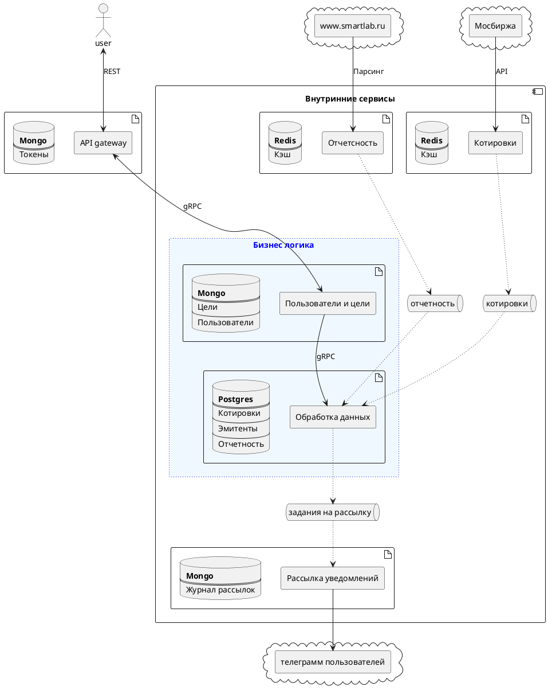

##
Сервис производит получение данных с API мосбиржи в заданном временном интервале


#### Общая идея
Наша цель – создать окружение вокруг одного основного сервиса с минимальной логической нагрузкой.
Простенький* сервис c полноценной обвязкой.


> \* c т.з бизнес логики.
Для дипломного проекта вам потребуется написать несколько сервисов. Поэтому это задание – хорошая возможность начать разработку одного из них. Вы можете считать это первым шагом к дипломной работе. И, самое главное, вы сейчас думаете о инфре, а потом только о логике(именно поэтому в больших компаниях есть платформенные команды). Ибо одновременно обо всем думать - гоняться на 2мя зайцами


- Делаем упор на архитектуру приложения(модульность) и обвязку вокруг него. Логику сервиса оставляем на десерт(т.е API чата c 20ю ручками и паданием с паникой и без логов это ~~не сдал~~ фаталити)
- Описываем документацию для вашего API(swagger). Было б очень классно иметь схемки/диаграммы(PlantUML)
- Протоколы и интеграции: grpc/http/graphql/socket/etc. - на выбор
- Конфигурация env/yaml
- Рейтлимиты/троттлинг. Пока в самом сервисе, просто для понимания устройства
- HealthCheck
- Логирование запросов и ответов(а можно ли автоматизировать?)
- Обработка ошибок и паник(хендлинг разных типов)
- Авторизация и аутентификация
- Валидация входящих данных
- Подключаем систему сбора метрик, чтобы можно было мониторить наши сервисы. Думаем и описываем список необходимых технических/бизнесовых метрик
- Реализуем трейсинг, чтобы отслеживать запросы через все сервисы и вовремя выявлять проблемы
- smth else?

## Схемы сервиса


### Сборк
Перед сборкой контейнеров поднимаем общую сеть
```
docker network create fin-network
```